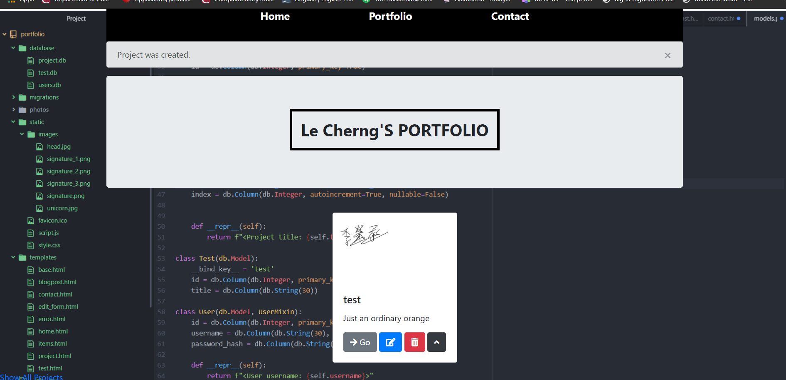

# Portfolio

To whoever adventurer came upon this! I assume that you are looking a portfolio template too! (´･ω･`)

The whole website is made using flask framework, aka the best python framework in my opinion. Netflix, Pininterest are using the very same framework with high number of traffics
and is easy to develop a website using flask. There are many library to help develop your website at even faster pace!  

#idea behind the code 

**description**
I was thinking to make use of SQLAlchemy database to store all my projects data in the website. 
Then later on I can implement login function where only I can access so I can add projects whenever I want even after I deploeyd
People say that a portfolio website doesn't need a database but is just matter of short run vs long run. Long run, you definitely saved a lot of time trying to adjust every single projects

**frontend**
Using Bootstrap card template makes it really neat, and logo of your social media helps out as well :D
One of the best functionaility in flask is inheritence, where you can inherits your base templates and reuse it in all your other pages
This is very important since you reduce the amount of code you written! 

**design pattern**
Model, View, Controller
The whole website are made of using this design pattern in mind. Most rookie programmers doesn't have a design pattern in mind although design patterns, if you are one of them, start learning design patterns now! 
This design pattern are most used in web applications, view are the routes where user can access, Model are the logic and process behind the website. 
And now this is pretty obvious why this design pattern is most used in web applications and also used in Game Programming too!   

This is example of the website 

The website is still not fully develop yet, I still haven't choose the best background pics
